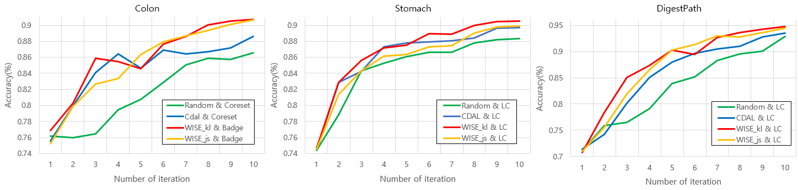

## What is WISE?

- WSI Informative SElection(WISE) is a new active learning methodology, specifically designed for the analysis of Whole Slide Images (WSIs).
- WISE embeds WSIs into WSI-level class distance and selects diverse cases using K-means++ to consider both the uncertainty and diversity of WSIs.
- WISE achieves state-of-the-art performance on the Colon, Stomach, and DigestPath datasets, significantly reducing the required number of WSIs by over threefold compared to the one-pool dataset setting assumed in previous studies.

## Highlights

The WISE method has been tested across multiple datasets, showing consistently superior performance. 

- **[Experiment 1]** To evaluate the effectiveness of the WSI selection method, the Patch AL method is consistently set to Random Sampling.
- **[Experiment 2]** To isolate the effects of different Patch AL methods, each Whole Slide Image (WSI) is chosen according to its respective WSI selection method, but only the Patch AL method is varied across all selections.
- **[Experiment 3]** To evaluate the efficiency of first selecting informative WSIs and then choosing patches, this approach is compared with pool-based active learning where WSIs are divided into patches within a one-pool.

1. **[Experiment 1 & 2] Comparison with WSI selection methods** 

 

**Figure1**. When ‘Patch active learning method=Random sampling', comparing performance of WSI selection methods



**Figure 2**. When best Patch active leanring method is applied, comparing performance of WSI selection methods

- When ‘Patch AL = RS’,

  - **[Colon]** WISE_kl : 90.2% Acc
  - **[Stomach]** WISE_kl : 88.6% Acc
  - **[DigestPath]** WISE_kl : 93.3% Acc

- When find best combination of WSI & Patch AL,

  - **[Colon]** Combination of ‘WISE_kl(WSI) & BADGE(patch)’ : 90.7% Acc
  - **[Stomach]** Combination of ‘WISE_kl(WSI) & Least confident(patch)’ : 90.5% Acc
  - **[DigestPath]** Combination of ‘WISE_kl(WSI) & Least confident(patch)’ : 94.8% Acc

2. **[Experiment 3]** Comparison with Pool-based methods with proposed method


**Figure 3**. Performance comparison between pool-based and proposed methods 


**Figure 4**. Comparison of trained WSI numbers between pool-based and proposed methods

- When comparing to the best-performing Pool-based methods,

  - **[Colon]** ‘WISE_kl & BADGE’ : 90.7% Acc  **>** pool_badge : 85.43% Acc
  - **[Stomach]** ‘WISE_kl & LC’ : 90.7% Acc  **>** pool_LC : 89.21%  Acc
  - **[DigestPath]** ‘WISE_kl & LC’ : 94.77% Acc  **>** pool_LC : 94.45%  Acc

- When considering the WSI utilization rates for training,

  - **[Colon]** WISE utilization: 25.7% > Pool-based best: 99.6%
  - **[Stomach]** WISE utilization: 26.2% > Pool-based best: 87.5%
  - **[DigestPath]** WISE utilization: 18.1% > Pool-based best: 58.3%

## Starting with WISE

#### Installation

For the latest version, clone directly from the git repository:

```bash
git clone https://github.com/gusrn0505/wise-active-learning.git
cd wise-active-learning
pip install -r requirements.txt
```

#### Tutorial

In this tutorial, we present test code that can be directly applied using the WISE algorithm for 3-class datasets, specifically tailored for Stomach and Colon data.

- The `test.ipynb` code allows immediate application of the WISE algorithm.
- Configurable settings include:
  - `CLASSES`: Classes of the dataset, e.g., `["N", "D", "M"]`.
  - `WSI_PATCH_SCORE`: A metric used to reflect the characteristics of patches within a WSI.
  - `WSI_REP_METHOD`: The computational method utilized to reflect WSI features.
  - `PATCH_STRATEGY`: How to select patches from chosen WSIs.

Additionally, a sample dataset is provided for flexible code application.

- The data is organized in the structure: `data/{Purpose}/{Class}/{slide_name}/{patch_name}`.
  - Example: `data/train/N/1/1_25_36.png`
- Each dataset is anonymized to remove any potentially identifying information.

## Code Description

WISE algorithm comprises several components, each designed to enhance the selection process of informative WSIs and patches. Comprehensive documentation and examples help users navigate through each code module effectively.

- **WSI_active_learning.py**
  - This is the main script, detailing the entire model training process through active learning. It orchestrates the workflow, integrating various components for an efficient learning cycle.
- **utils_selection_per_slide.py**
  - This script handles the invocation of WSI selection methods and patch active learning methods. It's key for determining which slides and patches are most informative and should be included in the training process.
- **utils_calculation.py**
  - Dedicated to calculations related to the proposed WISE method. It includes algorithms and functions that perform the necessary computations to evaluate and select the most informative slides.
- **config.py**
  - Describes model settings and hyperparameter values. This configuration file is crucial for setting up the learning environment, allowing for easy adjustments to optimize performance.
- **etc**
  - **dataloader.py** : Contains code related to make data loader.
  - **utils_model.py** : Focuses on model architecture and inference. It defines the structure of the model and includes functions for making predictions.
  - **utils_badge.py**: Implements the BADGE active learning algorithm.
  - **utils_cdal.py**: Contains code for the CDAL active learning algorithm.
  - **utils_coreset.py**: Implements the Coreset active learning algorithm.

## Implementation Detail

- **Model setting**

  - CNN architecture :  Resnet-18
  - Learning rate : 0.01
  - Optimizer : SGD / momentum=0.9
  - Scheduler : StepLR / step size = 10 / Gamma =0.2
  - Epoch : 50
  - Batch size = 128

- **Hyperparameter**

  - Initial # of WSI : N = 15 (DigestPath = 10)
  - Initial # of patch : M = 1000
  - Number of Iteration : T = 10
  - Number of selected WSI for iteration : k_wsi = 30 (DigestPath :10)
  - Number of selected patches for iteration : k_patch = 40 (DigestPath : 1)
  - Threshold of P_N : **ε** = 0.99

## Dataset

Our dataset comprises three distinct sources: Colon, Stomach, and DigestPath colonoscopy data, with the following specifics:

- The Colon and Stomach datasets originate from the Seegene Medical Foundation in Korea, subject to sharing restrictions.
- To complement these, we also utilize the publicly available DigestPath dataset.

#### Preprocessing Workflow for Whole Slide Images (WSI)


**Figure 5**. Process of making patches from WSI

1. **Patch Extraction**: Utilizing the 'OpenSlide' open-source Python library, we partition each WSI into smaller, more manageable patches.
2. **Patch Labeling**: Annotation-driven labeling is applied to distinguish patches. For class N (normal) WSI, no annotations are used. For classes M (malignant) and D (diseased), pathologist annotations guide the patch creation process.
3. **Annotation Comparison**: We compare annotated WSIs against their original counterparts to isolate annotated sections specifically.
4. **Patch Finalization**: By comparing annotated and original WSIs, we extract patches representing lesion areas. Each WSI is divided into patches of 256x256 pixels, which are then categorized into folders named after the WSI.
